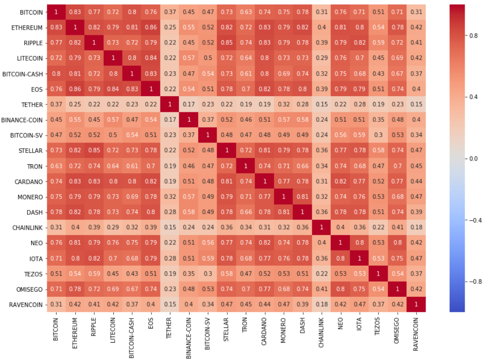
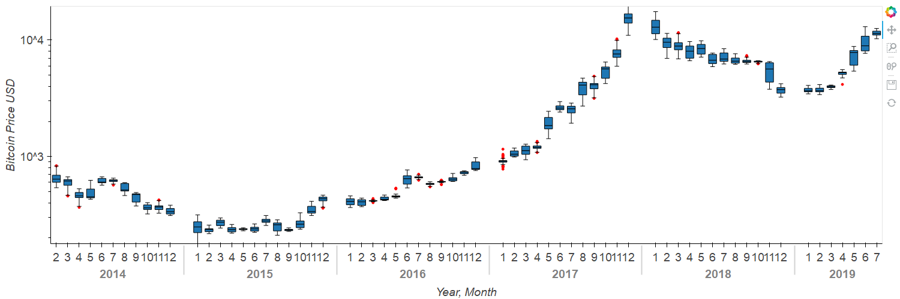

# DSND4: Write a Data Science Blog Post
## Simple method  to assess your next crypto investment
This projectis part of the course requirements for Udacity's [Data Scientist Nanodegree](https://www.udacity.com/course/data-scientist-nanodegree--nd025) certification.

## Motivation: Simple method  to assess your next crypto investment

In this work, we look at correlation analysis of the cryptocurrency market, using Python, to analyze and visualize how these markets have been evolving the years, and provide a base framework for deeper analysis. New to crypto ? You can find a great overview of Satoshi Nakamoto’s innovation [here](https://blockgeeks.com/guides/what-is-blockchain-technology/) 

## Data Sources

Modified [Kaggle dataset](https://www.kaggle.com/philmohun/cryptocurrency-financial-data) using data from 2014 -2019, for the top 100 cryptocurrencies by marketcap. Table attributes include:

* Date: refers to the calendar date for the particular row - 24 hours midnight to midnight
* Currency: e.g Bitcoin, price in USD at the end of the day

## Method and Results

The project followed the CRISP-DM method of data exploration's six steps of:
1. Business Understanding
2. Data Understanding
3. Data Preparation
4. Modeling
5. Evaluation
6. Deployment

The correlation and trend between various cryptocurrencies are evaluated to understand:
* Which coins can help diversify your portfolio: There is generally a strong correlation between coins, hence it is difficult to diversify risk (Just buying and holding Bitcoin is a safe bet).
* Are stable coins actually stable: Generally they appear to be decoupled from altcoin price fluctuations.
* If it is possible to predict the next bull run: Speculative at best. Nevertheless, end of 2019 looks similar to 2015, 2016 and 2017 … get ready to fill your bags.

  

  

All code used for the analysis can he found in the [notebook](https://github.com/PriceTT/DSND4/blob/master/1-EDA.ipynb).

To read the blog post associated with the article, you can go [here](https://medium.com/@pricett/simple-method-to-assess-your-next-crypto-investment-9443f56ee4bf?sk=e8353d849c18b47a77cc9f9a43989dc9).

## Files in the Repo
* 1-EDA.ipynb: [notebook](https://github.com/PriceTT/DSND4/blob/master/1-EDA.ipynb) for the analysis 
### data
* raw
  * Coinmarketcap.csv: Raw data
### Images
* img1.png
* img2a.png
* img2b.png
* img3.png
* img4.png
* img5.png
* img6.png

## Libaries Used
pandas, numpy, matplotlib, seaborn, [pyviz](https://towardsdatascience.com/pyviz-simplifying-the-data-visualisation-process-in-python-1b6d2cb728f1)
